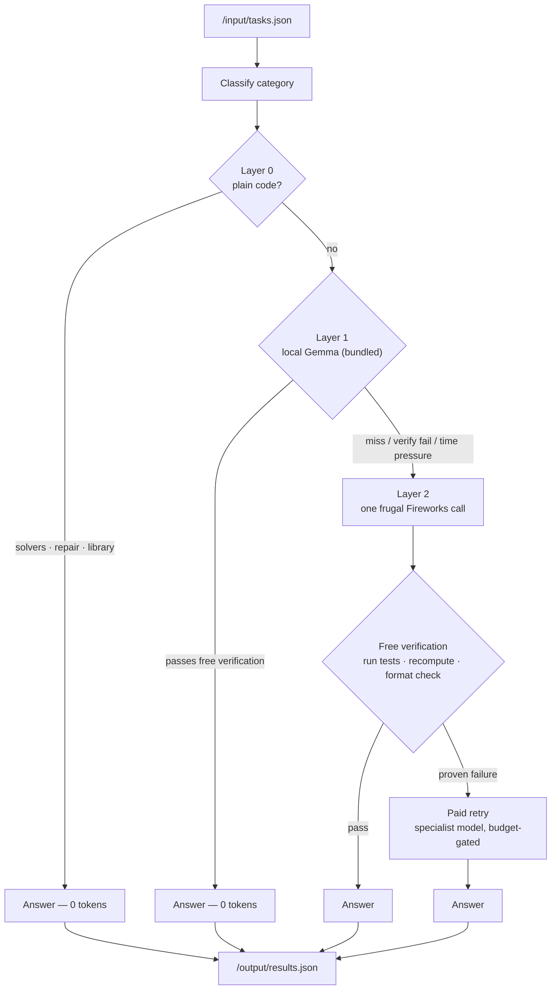

# TokenRouter

**A token-minimizing agent for the AMD Developer Hackathon: ACT II — Track 1.**
It answers with free plain code when it can, with a free in-container Gemma when it can verify, and spends the fewest Fireworks AI tokens it must for the rest.


---

## The idea

Track 1 scores every submission in two stages: an **accuracy gate** (an LLM judge checks each answer against the expected intent), then a ranking by **total Fireworks tokens** — fewer tokens wins. Crucially, work done *inside* the container is free: plain code costs nothing, and per the official rules a bundled local model's answers **count fully toward accuracy and zero toward the token score**.

TokenRouter is built entirely around that decision, on three principles:

1. **Solve for free when you can.** Arithmetic, five families of logic puzzles, single-edit bug repair, and classic codegen are computed in Go — no model, zero tokens.
2. **Answer locally when you can verify.** A bundled Gemma 4 E2B (Q4, sized for the 4 GB / 2 vCPU grading box) drafts answers next; generated code must pass the prompt's own examples and formatted answers must pass free checks before a local answer ships. Still zero tokens.
3. **Spend only on proven need.** Fireworks is the escalation tier: a paid call happens *only* when the free tiers miss or fail verification — never on a hunch — with `reasoning_effort: low` keeping scored thinking tokens down.

That verification-first stance is the differentiator: where a typical router *guesses* whether a task is "hard" and reaches for a bigger model, TokenRouter acts on **evidence** — it never pays for a second opinion on an answer that already passed a free check, and never keeps an answer that failed one.

## Architecture



- **Layer 0 — plain code (0 tokens).** Bare arithmetic is evaluated in Go; ordering, syllogism, knights-and-knaves, zebra-grid, and assignment puzzles are parsed and solved exhaustively; buggy code is repaired by single-edit mutation; classic codegen comes from a proven library. Everything self-gates strictly and *defers* on any ambiguity, so a misclassified task is rescued here but never answered wrongly.
- **Layer 1 — bundled local model (0 tokens).** A Gemma 4 E2B (Q4 GGUF, served by an in-container `llama-server`) drafts the answer. Code ships only after passing the prompt's own examples; PAL expressions are recomputed in Go; formatted answers must pass free checks. Local inference counts toward accuracy and zero toward the token score. Under deadline pressure the pacer skips this slow CPU tier.
- **Layer 2 — one frugal Fireworks call.** A tight, category-specific system prompt with a small `max_tokens` cap and `reasoning_effort: low`. Math word problems use **PAL**: the model returns a single arithmetic expression (~20 tokens) and Go computes the result. Generated code is executed against prompt-derived tests; a proven failure earns one budget-capped retry against the specialist model.

## The eight categories

Every category walks the same ladder — plain code, then the free local model, then one frugal Fireworks call — so the "typical cost" below is the *worst* case, not the common one.

| Category | Strategy | Worst-case cost |
|---|---|---|
| Mathematical reasoning | Bare expr → Go eval; else PAL locally, then remotely (model emits expression, Go computes) | ~20 tokens |
| Logic / deductive | Ordering, syllogism, knights-and-knaves, zebra-grid, and assignment solvers in Go; else local draft; else one reasoning call | one call |
| Code generation | Proven solution library → local draft (ships only if it passes the prompt's own asserts) → one call → specialist retry on proven failure | one call |
| Code debugging | Mutation repair (single-edit mutants vs prompt-derived asserts) → assert-verified local fix → same remote path | one call |
| Sentiment | Local label + format check; else terse remote prompt, tight cap | one call |
| Factual knowledge | Local draft + format check; else terse "answer concisely" prompt | one call |
| Named-entity recognition | Local typed list + format check; else remote | one call |
| Summarization | Local constrained summary + length check; else remote, no paid retry on long inputs | one call |

## Token-efficiency techniques

- **Plain-code solvers** — arithmetic AST evaluator, transitive-ordering (topological sort), universal syllogism (reachability). Correct by construction, zero tokens.
- **Brute-force puzzle solvers** (`PUZZLE_SOLVERS`) — knights-and-knaves (2ⁿ truth assignments), zebra-style attribute grids ((n!)² assignments), positional races with offsets (n! permutations). Strictly self-gating: any unparsed clue or ambiguous solution defers to the model, so a hit is always right and a miss costs nothing.
- **Mutation repair** (`MUTATION_REPAIR`) — debug tasks first try every single-edit mutant of the buggy code (flipped comparisons, off-by-ones, swapped operators) against asserts derived from the prompt's own examples. Answers only when the original provably fails and exactly one mutant passes — an APR-style fix for zero tokens.
- **Proven solution library** (`SOLUTION_LIB`) — classic codegen tasks (fibonacci, palindromes, brackets…) are answered from embedded canonical implementations, but only after the candidate passes the prompt's stated examples. The library never guesses; conventions (0- vs 1-indexed fibonacci) ship as variants and the examples arbitrate.
- **Duplicate-task dedup** (`DEDUP`) — normalized-identical prompts are answered once and copied; the same question is never paid for twice.
- **Bundled local tier** (`LOCAL`) — an in-container Gemma 4 E2B answers verified tasks for zero scored tokens; the pacer skips this slow CPU tier under deadline pressure, buying time with tokens instead.
- **Low reasoning effort** (`REASONING_EFFORT`) — thinking tokens are scored like any others, so remote calls request `reasoning_effort: low`, with a plain retry when an endpoint rejects the knob.
- **Prefix-cache affinity** (`PREFIX_CACHE`) — Fireworks discounts cached prompt prefixes (default 50%); a stable `x-session-affinity` header pins every call to one replica so the shared per-category system prompt stays cache-warm. Routing-only, no accuracy impact.
- **PAL for math** — the model translates a word problem into an expression; Go does the arithmetic, so it can't be wrong and costs a fraction of a worked solution.
- **Execution-based code verification** — asserts are derived from the prompt's stated examples and run locally; the paid specialist retry fires only when tests actually fail.
- **Terse category prompts + per-category `max_tokens`** — every scored token is deliberate; no filler, no preamble.
- **Single-pass + free verification** — no self-consistency sampling; correctness is checked with code, not by paying for extra samples.
- **Throughput-paced degradation** — a pacer projects the finish time against the 10-minute budget and gracefully reduces verification depth only under time pressure.
- **Opt-in batching** (`BATCH_SIZE`) — short single-answer tasks share one call, paying the system prompt once; a parse shortfall falls back to individual calls so no answer is ever dropped.
- **Opt-in stop sequences** (`STOP_SEQ`) — category-safe stops trim trailing filler from completions.
- **Opt-in prompt compression** (`PROMPT_COMPRESS`) — the task's own text is billed too: level 1 strips politeness boilerplate, level 2 extractively trims long summarization passages before the call.
- **Opt-in system-message merge** (`MERGE_SYSTEM`) — folds the system prompt into the user message, shaving the chat template's per-message role tokens.
- **Opt-in grammar-constrained decoding** (`GRAMMAR`) — sentiment answers are decoded under a GBNF grammar, making filler tokens impossible by construction (with an unconstrained fallback so no answer is ever lost).
- **Retry budget** (`RETRY_BUDGET`) — a global cap on paid second attempts, tunable between leaderboard probes.

Every one of these was added under a **measure-first discipline**: applied in isolation, measured on a local eval, and kept only when it demonstrably helped. The run-by-run log lives in [`eval/PERF.md`](eval/PERF.md). Features whose real effect can only be seen against the live API (batching, stop sequences) ship **off by default** as tunable knobs until validated.

## Container contract & robustness

The image implements the Track 1 contract exactly:

- Reads tasks from `/input/tasks.json` (`[{ "task_id", "prompt" }]`).
- Writes answers to `/output/results.json` (`[{ "task_id", "answer" }]`), then exits `0`.
- Reads `FIREWORKS_API_KEY`, `FIREWORKS_BASE_URL`, and `ALLOWED_MODELS` from the environment — nothing hardcoded, no bundled secrets.

Robustness is built in for a one-shot grader:

- A **skeleton `results.json`** with every `task_id` is written on startup, so even an early crash leaves valid, scorable JSON.
- All writes are **atomic** (temp file + rename) — output is never left half-written.
- **SIGTERM/SIGINT flush** the current answers before exiting, so an early kill still yields a valid file with everything answered so far.
- The whole run stays inside the 60-second start, 10-minute total, and 30-second-per-request limits.

## Quick start

Build for the judging VM (`linux/amd64`) and push to a public registry:

```bash
docker buildx build --platform linux/amd64 -t ghcr.io/omerdduran/token-router:latest --push .
```

Every push to `main` also builds and publishes the image via GitHub Actions.

Run it the way the harness does — mount input/output and inject the Fireworks environment:

```bash
docker run --rm \
  -v "$PWD/in:/input:ro" -v "$PWD/out:/output" \
  -e FIREWORKS_API_KEY=... \
  -e FIREWORKS_BASE_URL=... \
  -e ALLOWED_MODELS="gemma-4-31b-it,gemma-4-26b-a4b-it,kimi-k2p7-code,minimax-m3" \
  ghcr.io/omerdduran/token-router:latest
```

The image bundles the Go agent, `python3` (executes and verifies generated code), a lean static `llama-server`, and the Gemma 4 E2B Q4 weights — local inference is explicitly permitted and scores zero tokens.

## Configuration

| Variable | Default | Purpose |
|---|---|---|
| `FIREWORKS_API_KEY` | — | Injected by the harness |
| `FIREWORKS_BASE_URL` | — | All scored inference routes here |
| `ALLOWED_MODELS` | — | Comma-separated allowed model IDs |
| `WORKERS` | `4` | Parallel task workers |
| `TOTAL_BUDGET` | `9m15s` | Global deadline (inside the 10-min cap) |
| `REQUEST_TIMEOUT` | `25s` | Per-request timeout (under the 30s cap) |
| `RETRY_BUDGET` | `-1` | Max paid retries (`-1` = unlimited) |
| `BATCH_SIZE` | `0` | Batch short tasks per call (`0` = off) |
| `STOP_SEQ` | `false` | Category stop sequences |
| `LOCAL` | `true` | Bundled local-model layer (0 scored tokens) |
| `LOCAL_MODEL_PATH` | — (image sets it) | GGUF path; empty = probe `LOCAL_BASE_URL` for a dev server |
| `LOCAL_CATEGORIES` | all | Comma list of categories allowed to answer locally |
| `LOCAL_CTX_SIZE` / `LOCAL_PARALLEL` / `LOCAL_THREADS` | `4096` / `2` / auto | llama-server sizing for the 4 GB / 2 vCPU box |
| `LOCAL_REQUEST_TIMEOUT` | `20s` | Per-request cap for local generations |
| `REASONING_EFFORT` | `none` | Sent on Fireworks calls — measured live: `none` cut a reasoning model's completion from 31 to 2 tokens for the same answer; `""` disables sending |
| `PREFIX_CACHE` | `true` | Pin Fireworks calls to one replica (session affinity) so the shared prompt prefix hits the cache discount |
| `PUZZLE_SOLVERS` | `true` | Brute-force knights/zebra/position/assignment solvers |
| `MUTATION_REPAIR` | `true` | Single-edit repair of buggy code before a debug call |
| `SOLUTION_LIB` | `true` | Canonical solutions proven against prompt examples |
| `DEDUP` | `true` | Answer duplicate prompts once |
| `PROMPT_COMPRESS` | `0` | Input compression level (`0` off, `1` boilerplate, `2` +extractive) |
| `MERGE_SYSTEM` | `false` | Fold system prompt into the user message |
| `GRAMMAR` | `false` | GBNF-constrained sentiment decoding |
| `INPUT_PATH` / `OUTPUT_PATH` | `/input/tasks.json` / `/output/results.json` | Contract paths |

Components whose correctness is provable offline (self-gating solvers, proof-gated repair/library, dedup) default **on**; components whose effect depends on the live judge or tokenizer (compression, system merge, grammar) default **off** and wait in the submission-ladder queue for a live A/B.

## Development & evaluation

The client is endpoint-agnostic, so during development you can point it at a **local `llama.cpp` server** instead of Fireworks to iterate for free (the organizers recommend keeping dev off the paid API):

```bash
# point the same binary at a local OpenAI-compatible server
FIREWORKS_BASE_URL=http://127.0.0.1:8080 ALLOWED_MODELS=local \
INPUT_PATH=eval/tasks.json OUTPUT_PATH=out.json go run ./cmd/agent
```

Run the offline evaluation harness against the bundled mock proxy (no credits spent):

```bash
MOCK=1 eval/run.sh                       # runs eval/tasks.json through a mock Fireworks
MOCK=1 INPUT_PATH=eval/hard.json eval/run.sh
go run ./cmd/classcheck eval/tasks.json  # measure classifier accuracy standalone
go test ./...                            # unit tests
```

Four eval sets exercise different pressures: `tasks.json` (baseline, 8×8), `hard.json` (deliberately harder multi-step items), `paraphrased.json` (reworded to test robustness to unseen phrasing), and `components.json` (targeted probes for each experimental component — a solver-hit and a must-defer case per feature).

## Project layout

```
cmd/agent          entrypoint: contract I/O, worker pool, batching pre-pass
cmd/classcheck     standalone classifier-accuracy measurement tool
internal/classify  category classifier (lexical, scored)
internal/compress  opt-in prompt compression (boilerplate strip, extractive trim)
internal/router    routing, verification, PAL, batching, pacer, prompts
internal/solve     plain-code solvers: arithmetic, ordering, syllogism, puzzles,
                   mutation repair, solution library, code execution
internal/llm       OpenAI-compatible client + Fireworks model selection & token accounting
internal/verify    cheap category output checks
internal/config    environment configuration
internal/task      tasks.json / results.json (atomic write)
```

## Further reading

- [`slides/`](slides/) — the submission slide deck ([Slidev](https://sli.dev)): `cd slides && npm i && npm run dev`, or `npm run export` for the PDF.
- [`HACKATHON.md`](HACKATHON.md) — the Track 1 rules and scoring, consolidated.
- [`RESEARCH.md`](RESEARCH.md) — the literature review behind the token-efficiency choices (evidence → decision).
- [`eval/PERF.md`](eval/PERF.md) — the measurement log: every optimization, applied and measured in isolation, kept only if it helped.

## License

[MIT](LICENSE).
