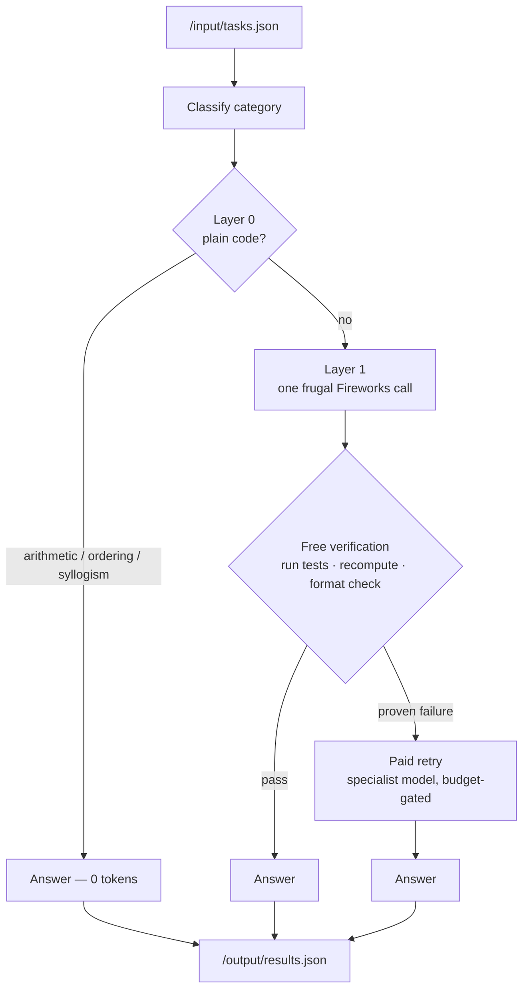

# TokenRouter

**A token-minimizing agent for the AMD Developer Hackathon: ACT II — Track 1.**
It answers with free plain code when it can, and spends the fewest Fireworks AI tokens it must when it can't.


<!-- After pushing, add the CI badge:
 -->

---

## The idea

Track 1 scores every submission in two stages: an **accuracy gate** (an LLM judge checks each answer against the expected intent), then a ranking by **total Fireworks tokens** — fewer tokens wins. Crucially, work done in plain code is free; only calls through the Fireworks API count.

As the organizers put it, *"routing intelligence" means deciding when a task needs an LLM call versus when it can be handled with plain code (zero tokens).* TokenRouter is built entirely around that decision, on two principles:

1. **Solve for free when you can.** Arithmetic, ordering and syllogism puzzles, and answer-checking are computed in Go — no model, zero tokens.
2. **Spend only on proven need.** Every model answer is verified with free plain code (execute the generated code against self-derived tests, re-evaluate arithmetic, check output format). A paid retry happens *only* on a proven failure — never on a hunch.

That verification-first stance is the differentiator: where a typical router *guesses* whether a task is "hard" and reaches for a bigger model, TokenRouter acts on **evidence** — it never pays for a second opinion on an answer that already passed a free check, and never keeps an answer that failed one.

## Architecture



- **Layer 0 — plain code (0 tokens).** Bare arithmetic is evaluated in Go; transitive-ordering and universal-syllogism puzzles are parsed into graphs and solved. These self-gate strictly and *defer* on any ambiguity, so a misclassified task is rescued here but never answered wrongly.
- **Layer 1 — one frugal API call.** A tight, category-specific system prompt with a small `max_tokens` cap. Math word problems use **PAL**: the model returns a single arithmetic expression (~20 tokens) and Go computes the result — cheaper than a worked solution and correct by construction.
- **Free verification → paid retry.** Generated code is executed against tests derived from the prompt's own examples; a failure earns one retry against the code specialist model. Format-sensitive categories get one corrective retry. All retries are capped by a global budget.

## The eight categories

| Category | Strategy | Typical cost |
|---|---|---|
| Mathematical reasoning | Bare expr → Go eval; else PAL (model emits expression, Go computes) | 0 or ~20 tokens |
| Logic / deductive | Ordering & syllogism solvers in Go; else one reasoning-model call | 0 or one call |
| Code generation | One call → execute against prompt-derived asserts → specialist retry on failure | one call |
| Code debugging | Same execution-based verification path | one call |
| Sentiment | Terse label prompt, tight cap | one call |
| Factual knowledge | Terse "answer concisely" prompt | one call |
| Named-entity recognition | Typed one-per-line format prompt | one call |
| Summarization | Length/format-constrained prompt, no paid retry on long inputs | one call |

## Token-efficiency techniques

- **Plain-code solvers** — arithmetic AST evaluator, transitive-ordering (topological sort), universal syllogism (reachability). Correct by construction, zero tokens.
- **PAL for math** — the model translates a word problem into an expression; Go does the arithmetic, so it can't be wrong and costs a fraction of a worked solution.
- **Execution-based code verification** — asserts are derived from the prompt's stated examples and run locally; the paid specialist retry fires only when tests actually fail.
- **Terse category prompts + per-category `max_tokens`** — every scored token is deliberate; no filler, no preamble.
- **Single-pass + free verification** — no self-consistency sampling; correctness is checked with code, not by paying for extra samples.
- **Throughput-paced degradation** — a pacer projects the finish time against the 10-minute budget and gracefully reduces verification depth only under time pressure.
- **Opt-in batching** (`BATCH_SIZE`) — short single-answer tasks share one call, paying the system prompt once; a parse shortfall falls back to individual calls so no answer is ever dropped.
- **Opt-in stop sequences** (`STOP_SEQ`) — category-safe stops trim trailing filler from completions.
- **Retry budget** (`RETRY_BUDGET`) — a global cap on paid second attempts, tunable between leaderboard probes.

Every one of these was added under a **measure-first discipline**: applied in isolation, measured on a local eval, and kept only when it demonstrably helped. The run-by-run log lives in [`eval/PERF.md`](eval/PERF.md). Features whose real effect can only be seen against the live API (batching, stop sequences) ship **off by default** as tunable knobs until validated.

## Container contract & robustness

The image implements the Track 1 contract exactly:

- Reads tasks from `/input/tasks.json` (`[{ "task_id", "prompt" }]`).
- Writes answers to `/output/results.json` (`[{ "task_id", "answer" }]`), then exits `0`.
- Reads `FIREWORKS_API_KEY`, `FIREWORKS_BASE_URL`, and `ALLOWED_MODELS` from the environment — nothing hardcoded, no bundled secrets.

Robustness is built in for a one-shot grader:

- A **skeleton `results.json`** with every `task_id` is written on startup, so even an early crash leaves valid, scorable JSON.
- All writes are **atomic** (temp file + rename) — output is never left half-written.
- **SIGTERM/SIGINT flush** the current answers before exiting, so an early kill still yields a valid file with everything answered so far.
- The whole run stays inside the 60-second start, 10-minute total, and 30-second-per-request limits.

## Quick start

Build for the judging VM (`linux/amd64`) and push to a public registry:

```bash
docker buildx build --platform linux/amd64 -t <registry>/token-router:latest --push .
```

Run it the way the harness does — mount input/output and inject the Fireworks environment:

```bash
docker run --rm \
  -v "$PWD/in:/input:ro" -v "$PWD/out:/output" \
  -e FIREWORKS_API_KEY=... \
  -e FIREWORKS_BASE_URL=... \
  -e ALLOWED_MODELS="gemma-4-31b-it,gemma-4-26b-a4b-it,kimi-k2p7-code,minimax-m3" \
  <registry>/token-router:latest
```

The image is just the Go binary plus `python3` (used to execute and verify generated code) — no model weights, per the Track 1 rules.

## Configuration

| Variable | Default | Purpose |
|---|---|---|
| `FIREWORKS_API_KEY` | — | Injected by the harness |
| `FIREWORKS_BASE_URL` | — | All scored inference routes here |
| `ALLOWED_MODELS` | — | Comma-separated allowed model IDs |
| `WORKERS` | `4` | Parallel task workers |
| `TOTAL_BUDGET` | `9m15s` | Global deadline (inside the 10-min cap) |
| `REQUEST_TIMEOUT` | `25s` | Per-request timeout (under the 30s cap) |
| `RETRY_BUDGET` | `-1` | Max paid retries (`-1` = unlimited) |
| `BATCH_SIZE` | `0` | Batch short tasks per call (`0` = off) |
| `STOP_SEQ` | `false` | Category stop sequences |
| `INPUT_PATH` / `OUTPUT_PATH` | `/input/tasks.json` / `/output/results.json` | Contract paths |

## Development & evaluation

The client is endpoint-agnostic, so during development you can point it at a **local `llama.cpp` server** instead of Fireworks to iterate for free (the organizers recommend keeping dev off the paid API):

```bash
# point the same binary at a local OpenAI-compatible server
FIREWORKS_BASE_URL=http://127.0.0.1:8080 ALLOWED_MODELS=local \
INPUT_PATH=eval/tasks.json OUTPUT_PATH=out.json go run ./cmd/agent
```

Run the offline evaluation harness against the bundled mock proxy (no credits spent):

```bash
MOCK=1 eval/run.sh                       # runs eval/tasks.json through a mock Fireworks
MOCK=1 INPUT_PATH=eval/hard.json eval/run.sh
go run ./cmd/classcheck eval/tasks.json  # measure classifier accuracy standalone
go test ./...                            # unit tests
```

Three eval sets exercise different pressures: `tasks.json` (baseline, 8×8), `hard.json` (deliberately harder multi-step items), and `paraphrased.json` (reworded to test robustness to unseen phrasing).

## Project layout

```
cmd/agent          entrypoint: contract I/O, worker pool, batching pre-pass
cmd/classcheck     standalone classifier-accuracy measurement tool
internal/classify  category classifier (lexical, scored)
internal/router    routing, verification, PAL, batching, pacer, prompts
internal/solve     plain-code solvers: arithmetic, ordering, syllogism, code execution
internal/llm       OpenAI-compatible client + Fireworks model selection & token accounting
internal/verify    cheap category output checks
internal/config    environment configuration
internal/task      tasks.json / results.json (atomic write)
```

## Further reading

- [`HACKATHON.md`](HACKATHON.md) — the Track 1 rules and scoring, consolidated.
- [`RESEARCH.md`](RESEARCH.md) — the literature review behind the token-efficiency choices (evidence → decision).
- [`eval/PERF.md`](eval/PERF.md) — the measurement log: every optimization, applied and measured in isolation, kept only if it helped.

## License

[MIT](LICENSE).
