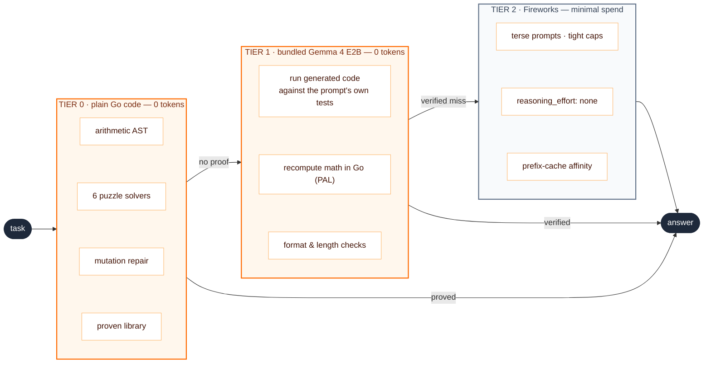

<h1 style="font-size:4.6rem; line-height:1.1; border:none;">
<span style="background:linear-gradient(90deg,#ff6a00 10%,#facc15 90%); -webkit-background-clip:text; background-clip:text; color:transparent; font-weight:700;">TokenRouter</span>
</h1>

### The prove-or-escalate agent

<div class="pt-6 text-xl opacity-80">
It never pays for what it can prove.
</div>

<div class="abs-br m-6 text-sm opacity-50">
AMD Developer Hackathon: ACT II · Track 1
</div>

---
layout: center
class: text-center
---

# One agent, eight task categories.<br>Two-thirds of the time, it pays <span class="text-orange-400">nothing</span>.

<v-click>

<div class="mt-8 text-xl opacity-90 max-w-170 mx-auto">

Math, logic, code, facts, sentiment, NER, summaries — TokenRouter answers them all,
but treats every API token as a <b>purchase that requires evidence</b>:
it proves an answer with free computation first, and buys one
only on a <b>proven</b> miss. Never on a hunch.

</div>

</v-click>

<v-click>

<div class="mt-10 text-lg">

The golden rule of its free tiers:<br>
<span class="text-orange-400 text-2xl font-bold">no proof → no answer → escalate.</span><br>
<span class="opacity-70">A wrong free answer is structurally impossible.</span>

</div>

</v-click>

---

# Three tiers, one ladder



<div class="mt-2 text-center opacity-70">
Each tier is cheaper than the next. Climbing requires <b>evidence</b>, not vibes.
</div>

---
layout: two-cols-header
---

# Tier 0 — the free floor

::left::

**Deterministic solvers** (plain Go, microseconds):

<v-clicks>

- Arithmetic expression evaluator
- Knights-and-knaves — brute-force 2ⁿ truth tables
- Zebra grids — exhaustive (n!)² assignment
- Positional races, orderings, syllogisms
- **Mutation repair** — single-edit mutants of buggy code, tested against asserts derived from the prompt's own examples
- **Proven-solution library** — classics ship only after passing the prompt's own examples

</v-clicks>

::right::

<v-click>

Real trace, official practice set:

```text {2}
task practice-02  layer=pal    → "144"
task practice-07  layer=code   → "Sam owns the cat."   0 tokens
task practice-05  layer=remote → NER, 4/4 entities
```

</v-click>

<v-click>

<div class="mt-4 p-4 border border-orange-400 rounded-lg text-sm">
Every solver <b>self-gates</b>: an unparsed clue or an ambiguous
solution means <i>defer</i>, never guess.<br><br>
A deferral costs a few tokens. A wrong answer costs the accuracy gate.
</div>

</v-click>

---
layout: two-cols-header
---

# Tier 1 — a local model you can trust

::left::

A **Gemma 4 E2B** (Q4 GGUF, llama.cpp) ships *inside* the image —
sized for the 4 GB / 2 vCPU grading box.

Local inference counts toward accuracy and **zero** toward the token score.
But a small model hallucinates — so nothing ships unverified:

<v-clicks>

- generated code → **executed** against prompt-derived tests
- math → model emits an expression, **Go recomputes it**
- everything else → format, length & refusal gates

</v-clicks>

::right::

<v-click>

<div class="p-4 bg-orange-400 bg-opacity-10 border border-orange-400 rounded-lg">

**Research-driven detail:** terse "draft" prompting costs sub-3B models
16–27 accuracy points *(Chain-of-Draft, arXiv 2502.18600)*.

So the local tier gets **full chain-of-thought** — its tokens are free —
while the paid tier stays terse.

</div>

</v-click>

<v-click>

<div class="mt-4 text-sm opacity-75">
Under deadline pressure a throughput pacer skips this slow CPU tier
entirely — buying time with tokens, gracefully.
</div>

</v-click>

---

# Tier 2 — when we do pay, we pay retail. Never list price.

<div class="grid grid-cols-3 gap-6 mt-10">

<v-click>

<div class="p-5 border border-neutral-600 rounded-xl text-center">
<div class="text-4xl font-bold text-orange-400">31 → 2</div>
<div class="mt-2 text-sm opacity-80">completion tokens for the same answer with
<code>reasoning_effort: none</code> — <b>measured live</b>; thinking tokens are billed like any others</div>
</div>

</v-click>

<v-click>

<div class="p-5 border border-neutral-600 rounded-xl text-center">
<div class="text-4xl font-bold text-orange-400">54 / 62</div>
<div class="mt-2 text-sm opacity-80">prompt tokens served from cache on the second call —
session-affinity keeps the shared prefix warm (<b>measured live</b>)</div>
</div>

</v-click>

<v-click>

<div class="p-5 border border-neutral-600 rounded-xl text-center">
<div class="text-4xl font-bold text-orange-400">1 retry</div>
<div class="mt-2 text-sm opacity-80">paid retries happen only on <b>proven</b> failure
(failed tests, broken format) and are capped by a global budget knob</div>
</div>

</v-click>

</div>

<v-click>

<div class="mt-10 text-center opacity-80">
Terse category prompts · per-category <code>max_tokens</code> · PAL for math (~20 tokens instead of a worked solution)
</div>

</v-click>

---
layout: fact
---

# 59 → 23

### Fireworks calls on our 64-task eval — **−61%**

<div class="grid grid-cols-3 gap-8 mt-12 text-center">

<div>
<div class="text-3xl font-bold text-orange-400">~2 / 3</div>
<div class="text-sm opacity-75 mt-1">of tasks answered at<br><b>zero scored tokens</b></div>
</div>

<div>
<div class="text-3xl font-bold text-orange-400">20 → 7</div>
<div class="text-sm opacity-75 mt-1">calls on the deliberately<br>hard eval set (−65%)</div>
</div>

<div>
<div class="text-3xl font-bold text-orange-400">2m 45s</div>
<div class="text-sm opacity-75 mt-1">64 tasks on a 2-thread CPU proxy<br>(10-minute budget)</div>
</div>

</div>

<div class="mt-10 text-sm opacity-60">
Measured on our own eval sets against the real local model — honestly labeled, no leaderboard claims.
</div>

---
layout: two-cols-header
---

# We measure. Even when it kills our favorite idea.

::left::

<div class="pr-8">

**The bake-off:** research said *"a stronger 3–4B local model should
raise free-tier accuracy."* We tested it — 54 tasks, two real models,
a 3-judge panel per answer.

<div class="mt-4 text-sm">

| | free & correct | free & **wrong** | escalated |
|---|---|---|---|
| **Gemma 4 E2B** | **46** | **2** | 5 |
| Gemma 3 4B | 39 | <span class="text-red-400 font-bold">12</span> | 2 |

</div>

</div>

::right::

<v-click>

The bigger model answered *more* — and was wrong **6× more often**.
Every wrong free answer is an accuracy-gate loss.

<div class="mt-4 p-4 border border-orange-400 rounded-lg">
<b>Lesson:</b> raw model strength matters less than
<b>calibration to the verification gates</b>. E2B escalates when unsure;
the 4B pushed confident-but-wrong answers.
</div>

</v-click>

<v-click>

<div class="mt-4 text-sm opacity-75">
Every optimization lives in a perf journal: applied in isolation, measured,
kept only if it helped. Unproven features ship behind default-off flags.
</div>

</v-click>

---

# It cannot crash, stall, or emit bad JSON

<div class="grid grid-cols-2 gap-x-10 mt-6 text-[0.95rem]">

<div>

- 📄 **Skeleton `results.json` at startup** — even an instant crash leaves valid, scorable JSON
- ⚛️ **Atomic writes** (temp + rename) — output can never be half-written
- 🛑 **SIGTERM flush** — an early kill still submits everything answered so far

</div>

<div>

- 🧯 **Per-task panic isolation** — one adversarial prompt can't take down the run
- ⏱️ **Throughput pacer** — projects the finish time, degrades gracefully under pressure
- 🧪 **Fuzz-tested** — 200k-char prompts, control bytes, unicode floods: no panics, valid output

</div>

</div>

<v-click>

<div class="mt-10 p-4 text-center text-lg border border-orange-400 rounded-lg">
The image passed the real contract under grading limits:<br>
<code>--memory 4g --cpus 2</code> → model loaded in 21 s, 8/8 answered, exit 0.
</div>

</v-click>

---
layout: center
class: text-center
---

# Gemma, everywhere

<div class="mt-6 text-xl leading-relaxed">

**Gemma 4 E2B** answers locally for free —<br>
chosen over a bigger sibling *on measured evidence*.

**Fireworks Gemma 4** (26B-A4B / 31B) handles the escalations —<br>
with thinking off and prompts tuned per category.

</div>

<v-click>

<div class="mt-10 opacity-70">
One model family, two tiers, every routing decision earned by data.
</div>

</v-click>

---
layout: end
class: text-center
---

# TokenRouter

<div class="text-xl mt-4 opacity-90">
Prove it for free — or buy the minimum.
</div>

<div class="mt-10 text-sm opacity-70">

**Go** orchestrator · **llama.cpp** + Gemma 4 E2B in-container · **Fireworks AI** escalation<br>
3.1 GB image · 50 tests incl. fuzz · every claim in this deck is logged in **eval/PERF.md**

</div>

<div class="mt-8 text-sm opacity-50">
github.com/omerdduran/token-router
</div>
